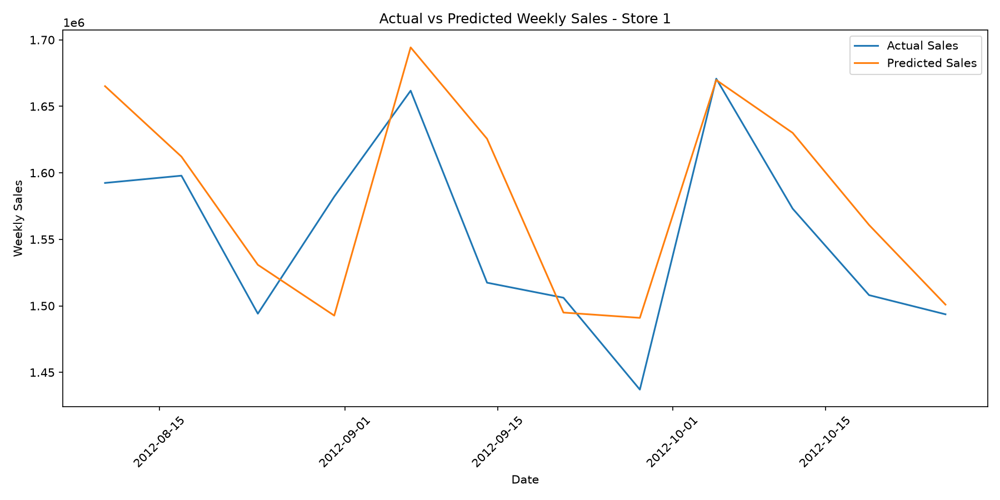
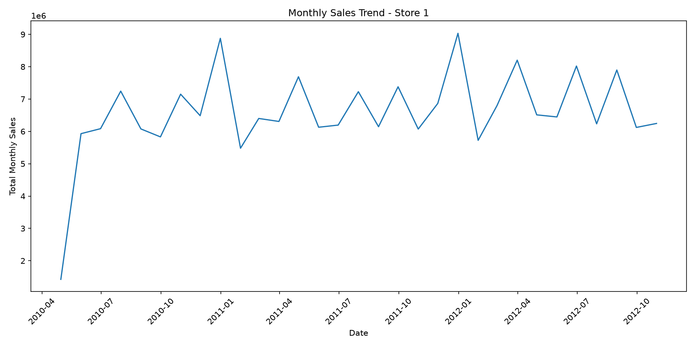
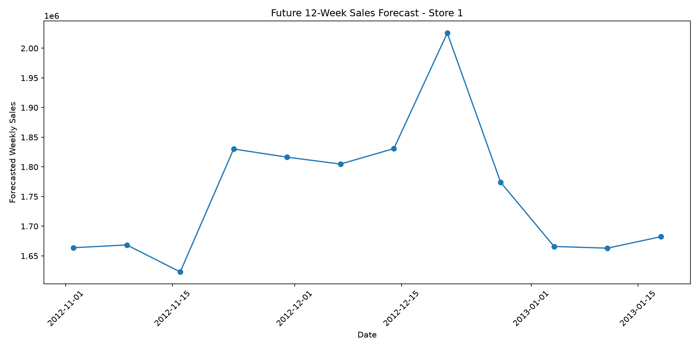

# FUTURE_ML_01 - Sales & Demand Forecasting

## Internship Task
Future Interns - Machine Learning Internship

### Task 1: Sales & Demand Forecasting for Businesses

---

## Project Overview

This project focuses on forecasting future weekly sales using historical Walmart sales data.

The objective is to build a Machine Learning model that can learn from historical sales patterns and predict future sales. These predictions can help businesses with inventory planning, staffing, promotions, and resource management.

---

## Problem Statement

Businesses need accurate sales forecasts to make better decisions about:

- Inventory management
- Staffing
- Promotions
- Resource planning
- Business operations

This project uses historical Walmart sales data and Machine Learning to forecast future weekly sales for a selected store.

---

## Dataset

The project uses the public Walmart Sales dataset.

### Dataset Source

Kaggle - Walmart Sales Dataset:

https://www.kaggle.com/datasets/mikhail1681/walmart-sales

### Dataset Features

The dataset contains the following columns:

- `Store` - Store identification number
- `Date` - Weekly sales date
- `Weekly_Sales` - Weekly sales value
- `Holiday_Flag` - Indicates whether the week is a holiday week
- `Temperature` - Temperature during the week
- `Fuel_Price` - Fuel price
- `CPI` - Consumer Price Index
- `Unemployment` - Unemployment rate

---

## Technologies Used

- Python
- Pandas
- NumPy
- Scikit-learn
- Matplotlib
- VS Code
- GitHub

---

## Project Workflow

The project follows these steps:

1. Load the Walmart sales dataset
2. Inspect the dataset
3. Clean missing values and duplicate records
4. Select Store 1 for forecasting
5. Convert the date column into useful time features
6. Create lag and rolling features
7. Split the data based on time
8. Train a Random Forest Regression model
9. Evaluate model performance
10. Generate future 12-week sales forecasts
11. Create business-friendly visualizations
12. Generate business insights

---

## Data Cleaning

The dataset contains 6,435 records.

After checking the dataset:

- Missing values: None
- Duplicate records: Removed if present
- Data type conversions were performed where required

After cleaning:

**6,435 rows were available for analysis.**

---

## Store Selection

For this project, **Store 1** was selected for detailed sales forecasting.

Historical data available for Store 1:

- Records: 143 weeks
- Start Date: 2010-02-05
- End Date: 2012-10-26

---

## Feature Engineering

The following time-based features were created:

- Year
- Month
- Quarter
- Week
- Day
- Time Index

The following historical sales features were also created:

- Lag 1
- Lag 4
- Lag 12
- Rolling 4
- Rolling 12

These features help the Machine Learning model understand historical sales patterns and trends.

---

## Machine Learning Model

### Random Forest Regressor

A Random Forest Regression model was used for sales forecasting.

The model was selected because it can capture nonlinear relationships between historical sales, time-based features, and other business factors.

### Training and Testing

The data was divided using a time-based split:

- Training records: 119
- Testing records: 12

The latest 12 weeks were used for testing so that the evaluation represents future prediction conditions.

---

## Model Performance

The model produced the following results:

| Metric | Result |
|---|---:|
| MAE | 44,755.09 |
| RMSE | 55,314.40 |
| R² Score | 0.3494 |

### Interpretation

The model achieved an R² score of approximately 0.35, meaning it explains around 35% of the variation in the test sales data.

The model captures the overall sales pattern, but there is still room for improvement in predicting individual weekly fluctuations.

---

## Future Sales Forecast

The trained model was used to forecast the next **12 weeks** of sales.

The forecast period is:

**2012-11-02 to 2013-01-18**

The predicted weekly sales range approximately from:

**1.62 million to 2.03 million**

The forecast shows higher expected sales during December, followed by a decrease toward January.

---

## Visualizations

### Actual vs Predicted Weekly Sales

The visualization compares actual sales with the sales predicted by the Random Forest model.

### Monthly Sales Trend

The monthly sales trend visualization shows changes in sales over time.

### Future 12-Week Sales Forecast

The forecast visualization shows predicted weekly sales for the next 12 weeks.

---

## Business Insights

The forecasting results can help businesses:

- Plan inventory according to expected demand
- Prepare staff for periods of higher demand
- Plan promotional campaigns
- Allocate resources efficiently
- Identify periods of increasing or decreasing sales
- Improve short-term operational planning

The forecast indicates increased expected sales during December, which may require additional inventory and operational preparation.

---

## Project Output Files

The `outputs` folder contains:

- `model_metrics.csv`
- `test_predictions.csv`
- `actual_vs_predicted.png`
- `monthly_sales.csv`
- `monthly_sales_trend.png`
- `future_12_week_forecast.csv`
- `future_12_week_forecast.png`
- `business_insights.txt`

---

## Limitations

- The model was developed for Store 1.
- Only 143 weekly observations were available for the selected store.
- The model does not capture every unexpected sales fluctuation.
- Future external factors may affect actual sales.
- Forecast accuracy can be improved using more historical data and advanced time-series models.

---

## Conclusion

This project demonstrates how Machine Learning can be used to forecast future business sales.

A Random Forest Regression model was trained using historical Walmart sales data and used to generate a 12-week future sales forecast.

The results provide useful information for inventory planning, staffing, promotions, and business decision-making.

---

## Author

**K.Harish Kumar**

Future Interns - Machine Learning Internship